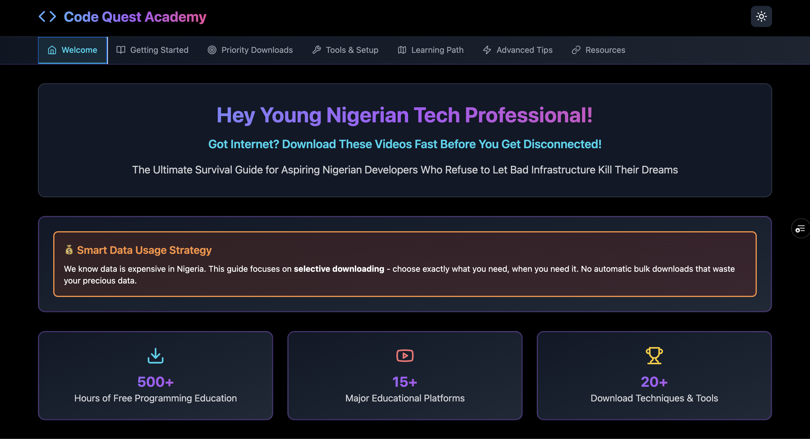
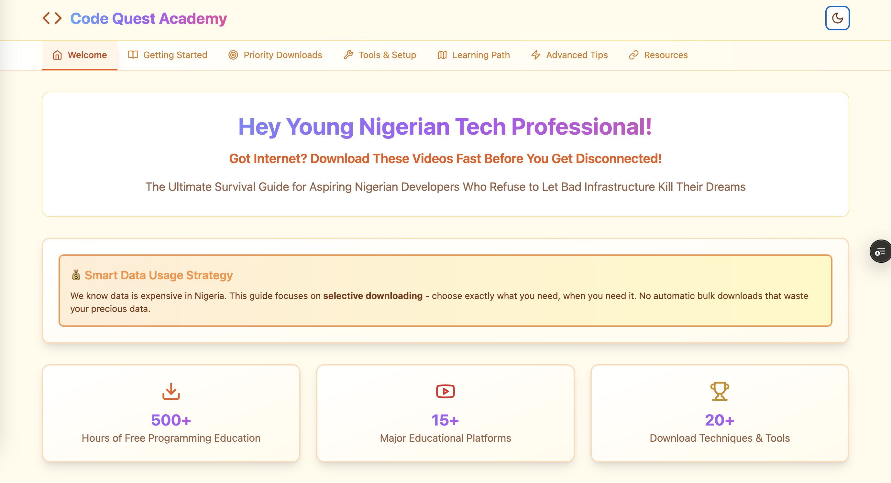

# 🚀 Code Quest Academy - Got Internet? Download Now!

[](https://got-internet-download-now.vercel.app/)


*AI-Powered Folder Creation Modal in Dark Mode*


*AI-Powered Folder Creation Modal in Light Mode*

## 🇳🇬 Built for Nigerian Developers, By Developers

**Code Quest Academy** is a strategic learning platform designed specifically for Nigerian developers who face the daily challenge of unreliable internet connectivity. We understand the struggle of trying to learn programming when your internet works in "windows" - brief periods when everything functions perfectly before something inevitably goes wrong.

## ✨ Features

### 🤖 **NEW: AI-Powered Folder Creation**
Our latest feature adds a fun twist to the Getting Started experience! Click the "🤖 Let AI create this for you!" button to open an interactive modal that:

- 📋 **Copy-Paste Ready**: Instantly copy the complete folder structure to paste into ChatGPT, Gemini, or any AI assistant
- 💻 **OS-Specific Commands**: Get ready-to-use terminal commands for Windows, macOS, and Linux
- 🎯 **Smart Instructions**: Step-by-step guide on how to prompt AI systems for folder generation
- 🌓 **Theme Support**: Beautiful dark and light mode styling that adapts to your preference
- 🇳🇬 **Nigerian Context**: Includes practical tips about external drives and NEPA power outages

### 📚 **Strategic Learning System**
- **Internet Window Strategy**: Maximize those precious moments when your connection actually works
- **Priority Download System**: Know exactly what to download first during your internet windows
- **30-Minute Emergency Protocol**: Optimized download sequence for short connection windows
- **Smart Organization**: Pre-planned folder structure for efficient content management

### 🎯 **Core Sections**
1. **Welcome** - Introduction to the Code Quest philosophy
2. **Getting Started** - Strategic approach to offline learning with AI-powered folder creation
3. **Priority Downloads** - Curated list of essential programming resources
4. **Tools & Setup** - Development environment configuration
5. **Learning Path** - Structured progression for different skill levels
6. **Advanced Tips** - Pro strategies for maximizing learning efficiency
7. **Resources** - Additional tools and references

### 🎨 **User Experience**
- **Responsive Design**: Works perfectly on desktop, tablet, and mobile devices
- **Dark/Light Mode**: Toggle between themes with smooth transitions
- **Nigerian Developer Humor**: Authentic context that resonates with local experiences
- **Toast Notifications**: Instant feedback for user interactions
- **Accessibility**: Built with screen readers and keyboard navigation in mind

## 🛠️ Technology Stack

- **Frontend**: React 18 + TypeScript
- **Build Tool**: Vite for lightning-fast development
- **Styling**: Tailwind CSS with custom design system
- **UI Components**: Radix UI primitives for accessibility
- **Icons**: Lucide React + FontAwesome
- **State Management**: React hooks
- **Notifications**: Sonner for toast messages
- **Deployment**: Vercel for seamless hosting

## 🚀 Getting Started

### Prerequisites
- Node.js 18+ 
- npm or yarn package manager

### Installation

1. **Clone the repository**
   ```bash
   git clone https://github.com/raimonvibe/got-internet-download-now.git
   cd got-internet-download-now
   ```

2. **Install dependencies**
   ```bash
   npm install
   ```

3. **Start development server**
   ```bash
   npm run dev
   ```

4. **Open your browser**
   Navigate to `http://localhost:5173`

### Available Scripts

- `npm run dev` - Start development server with hot reload
- `npm run build` - Build for production
- `npm run preview` - Preview production build locally
- `npm run lint` - Run ESLint for code quality

## 🎯 The Nigerian Developer Experience

### 🌅 **Golden Hours Strategy**
- **Early Morning (5-7 AM)**: Before everyone wakes up and congests the network
- **Late Night (11 PM - 2 AM)**: After Netflix users go to sleep
- **Weekday Afternoons (2-4 PM)**: When schools are in session
- **Post-Rain Windows**: Network less congested after weather clears

### ⚡ **Speed-Based Download Strategy**
- **> 5 Mbps**: Go for video downloads (freeCodeCamp, CS50)
- **1-5 Mbps**: Download documentation, PDFs, and text-based resources
- **< 1 Mbps**: Browse and bookmark for later, focus on planning

### 🏗️ **Smart Folder Organization**
The AI modal helps you create this optimized structure:

```
~/OfflineLearning/
├── 01_Priority_Downloads/
│   ├── freeCodeCamp_Python/
│   ├── CS50_Harvard/
│   ├── MIT_OpenCourseWare/
│   └── Programming_with_Mosh/
├── 02_Specialization/
│   ├── Web_Development/
│   ├── Mobile_Apps/
│   ├── Data_Science/
│   └── Game_Development/
├── 03_Advanced_Topics/
│   ├── Algorithms/
│   ├── System_Design/
│   └── Machine_Learning/
└── 04_Project_Tutorials/
    ├── Portfolio_Projects/
    ├── Real_World_Apps/
    └── Interview_Prep/
```

## 🤖 AI Modal Features

### Step 1: Copy Structure
- One-click copying of the complete folder hierarchy
- Formatted for easy pasting into AI chat interfaces
- Includes all subdirectories and organization logic

### Step 2: AI Prompting
- Clear instructions on how to ask AI for terminal commands
- Works with ChatGPT, Gemini, Claude, and other AI assistants
- Educational approach that teaches users to leverage AI tools

### Step 3: Quick Commands
Ready-to-use terminal commands for immediate folder creation:

**Windows (Command Prompt/PowerShell):**
```cmd
mkdir OfflineLearning && cd OfflineLearning && mkdir 01_Priority_Downloads 02_Specialization 03_Advanced_Topics 04_Project_Tutorials
```

**macOS/Linux:**
```bash
mkdir -p ~/OfflineLearning/{01_Priority_Downloads,02_Specialization,03_Advanced_Topics,04_Project_Tutorials}
```

### 💡 Pro Tips
- Create the structure on external drives for backup
- Plan during low-internet periods, execute during high-speed windows
- Use the folder system to stay organized even when offline

## 🎨 Design Philosophy

### Nigerian Context First
Every feature is designed with the Nigerian developer experience in mind:
- **NEPA References**: Acknowledging power infrastructure challenges
- **Internet Windows**: Understanding connectivity patterns
- **Practical Solutions**: Real-world strategies that actually work
- **Community Humor**: Authentic voice that resonates with local developers

### Accessibility & Inclusion
- Screen reader compatible
- Keyboard navigation support
- High contrast ratios in both themes
- Mobile-first responsive design
- Clear visual hierarchy and typography

## 🤝 Contributing

We welcome contributions from the Nigerian developer community and beyond!

### How to Contribute
1. Fork the repository
2. Create a feature branch (`git checkout -b feature/amazing-feature`)
3. Commit your changes (`git commit -m 'Add amazing feature'`)
4. Push to the branch (`git push origin feature/amazing-feature`)
5. Open a Pull Request

### Development Guidelines
- Follow the existing code style and patterns
- Test your changes in both light and dark modes
- Ensure mobile responsiveness
- Add appropriate TypeScript types
- Update documentation for new features

## 📱 Connect with Raimon

- **X (Twitter)**: [@raimonvibe](https://x.com/raimonvibe/)
- **YouTube**: [Raimon Vibe Channel](https://www.youtube.com/channel/UCDGDNuYb2b2Ets...)
- **TikTok**: [@raimonvibe](https://www.tiktok.com/@raimonvibe/)
- **Instagram**: [@raimonvibe](https://www.instagram.com/raimonvibe/)
- **Medium**: [@raimonvibe](https://medium.com/@raimonvibe/)
- **GitHub**: [@raimonvibe](https://github.com/raimonvibe/)
- **LinkedIn**: [Raimon Vibe](https://www.linkedin.com/in/raimonvibe/)

## 📄 License

This project is licensed under the MIT License - see the [LICENSE](LICENSE) file for details.

## 🙏 Acknowledgments

- **Nigerian Developer Community**: For inspiring this project with real challenges and solutions
- **freeCodeCamp**: For providing excellent free programming education
- **CS50**: For world-class computer science fundamentals
- **All Contributors**: Who help make this platform better for everyone

---

**Built with ❤️ for Nigerian developers who refuse to let poor internet stop their coding dreams.**

*"Smart planning beats fast internet every time!" - Code Quest Academy*
